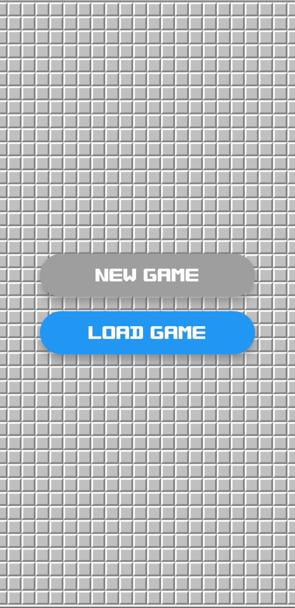
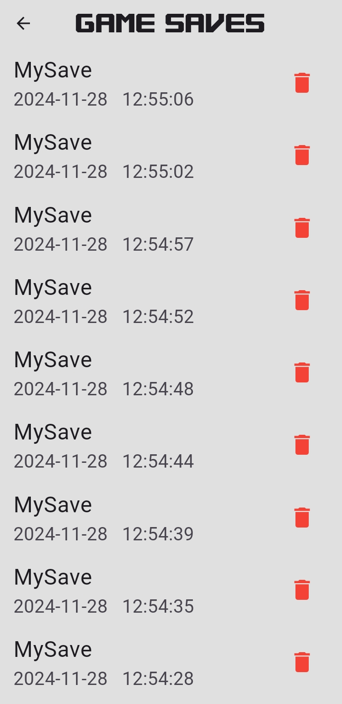
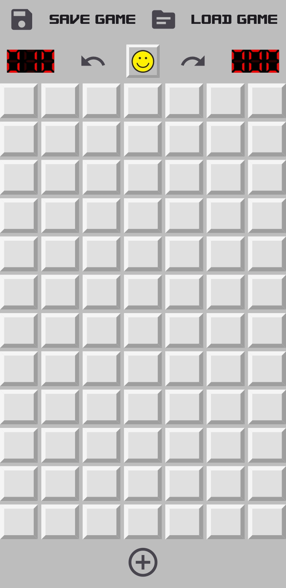
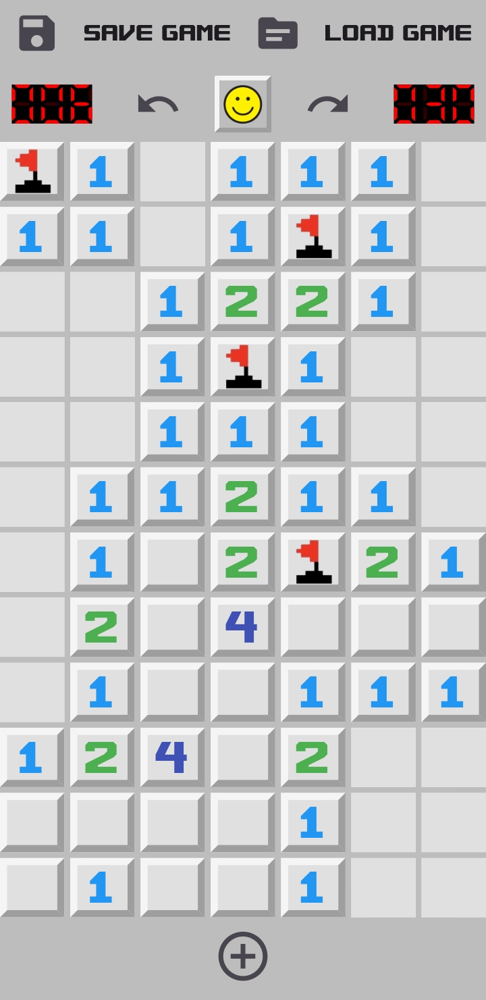
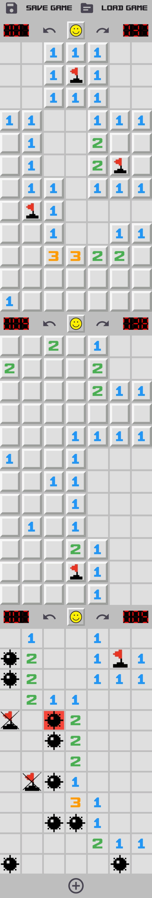

# Minesweeper 🚩💣

A modern take on Minesweeper with exciting features and a clean, dynamic interface. Play multiple boards simultaneously, save your progress, and enjoy advanced controls like undo and redo!

---

## 🕹️ **Features**

- **Save and Load Game**: Resume your progress anytime.
- **Multi-Board Gameplay**: Play on multiple boards with independent timers and flag counters.
- **Undo/Redo Actions**: Easily revert or repeat your moves for better control.

---

## 📸 **Screenshots**

## 📸 **Gallery**

### Screenshots

<table>  
  <tr>  
    <td align="center">  
      <b>Start Screen</b>
      <br></br> 
        
    </td>  
    <td align="center">  
      <b>Load Screen</b>
      <br></br> 
        
    </td>  
  </tr>  
  <tr>  
    <td align="center">  
      <b>Game Started</b>
      <br></br> 
        
    </td>  
    <td align="center">  
      <b>During Gameplay</b> 
      <br></br> 
        
    </td>  
  </tr>  
  <tr>  
    <td colspan="2" align="center">  
      <b>Multiple Boards</b>
      <br></br> 
        
    </td>  
  </tr>  
</table>  
 
---

## 🚀 **Getting Started**

1. Clone the repository:
   ```bash
   git clone https://github.com/yourusername/minesweeper.git
   cd minesweeper
   ```
2. Run the app:
   ```bash
   flutter pub get
   flutter run
   ```
